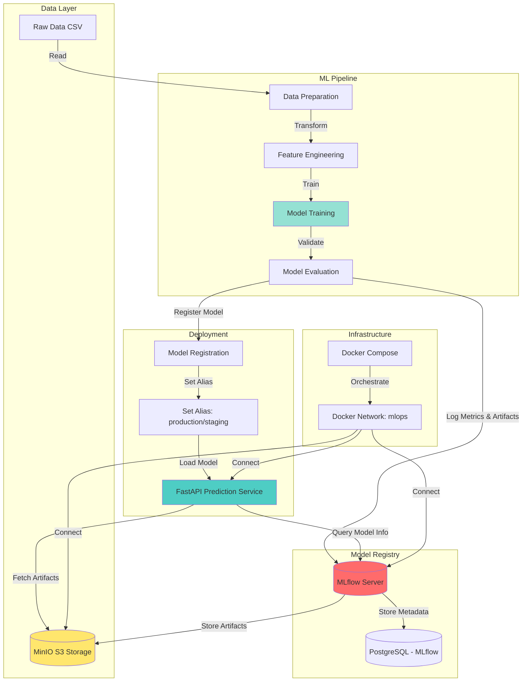
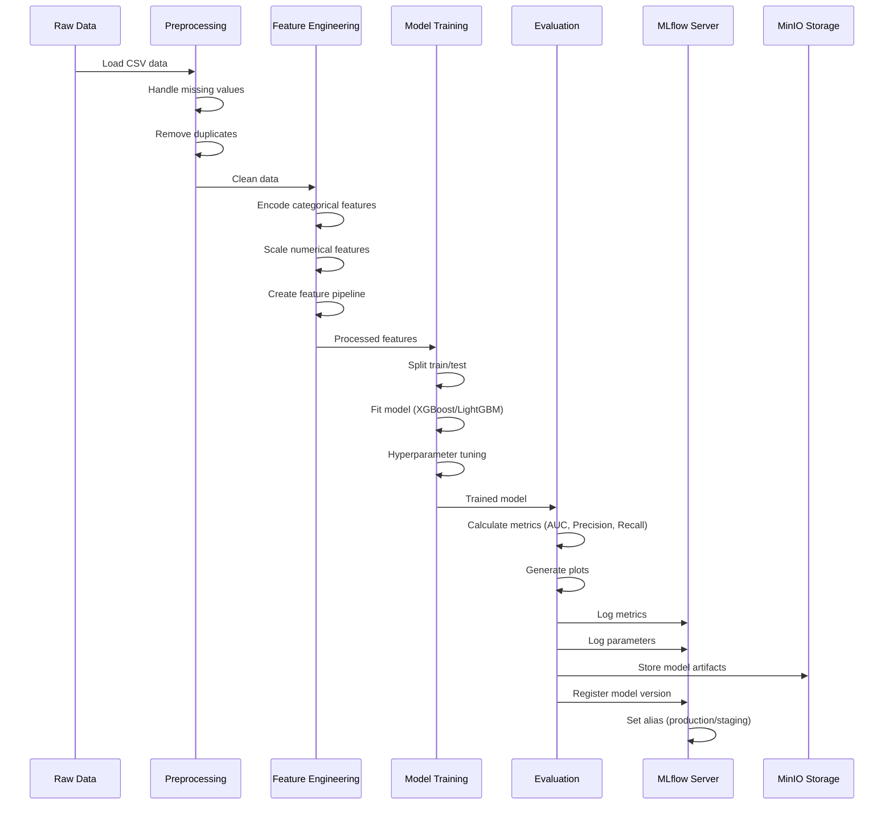
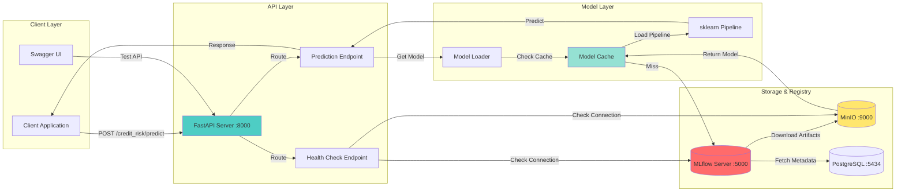
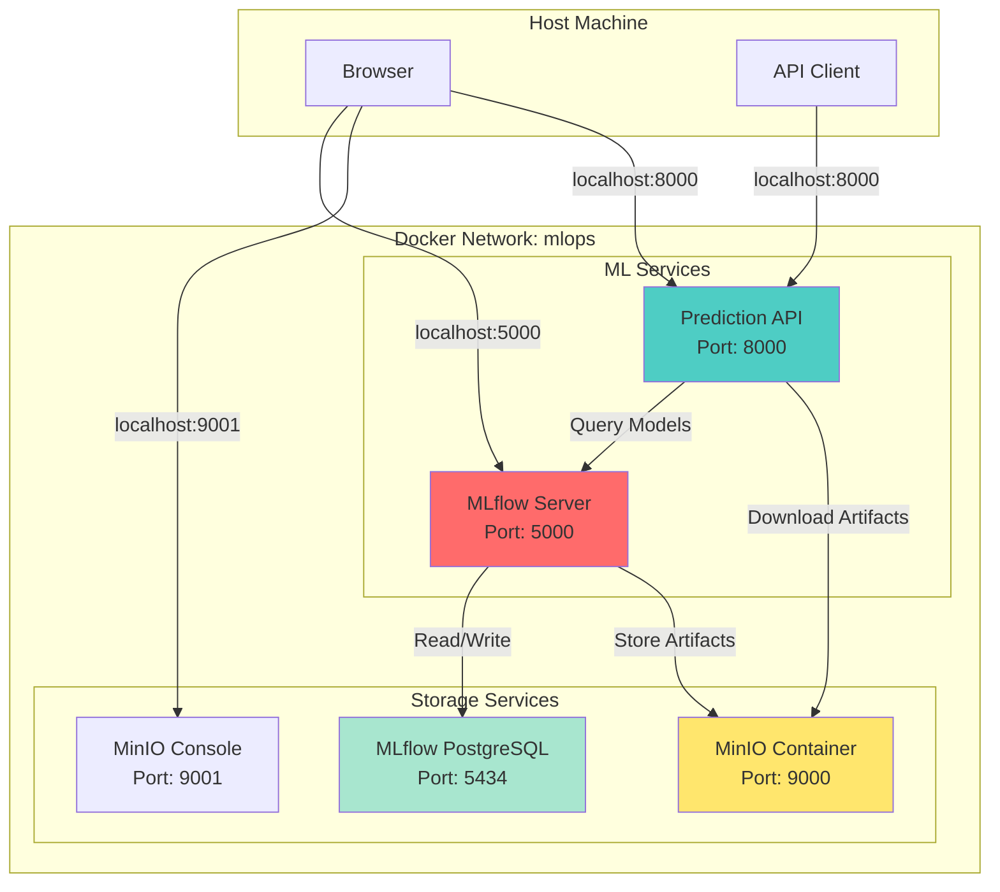
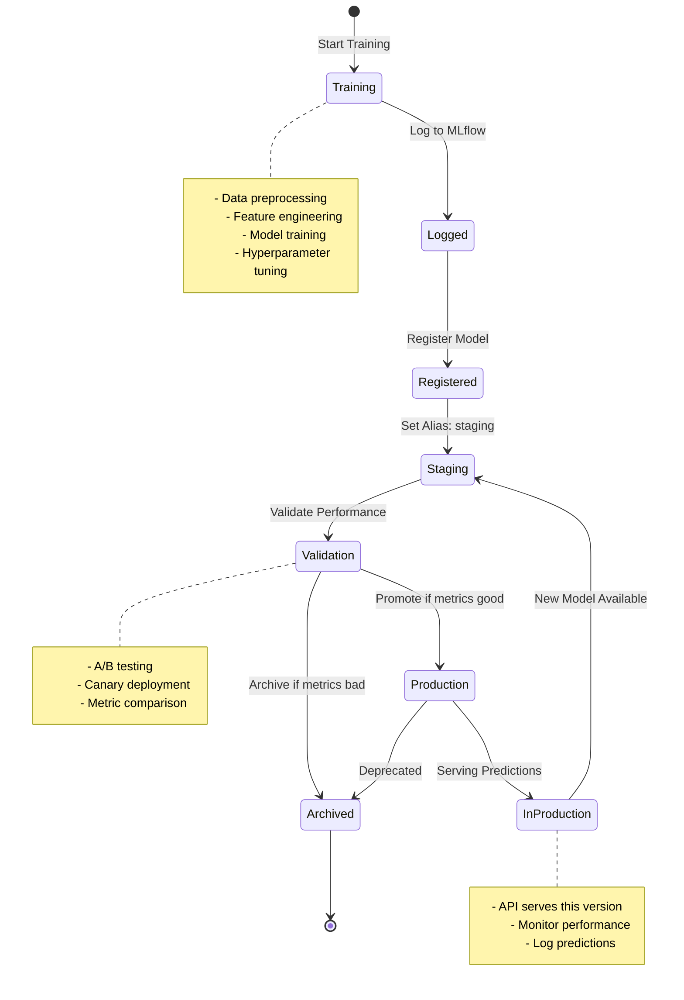
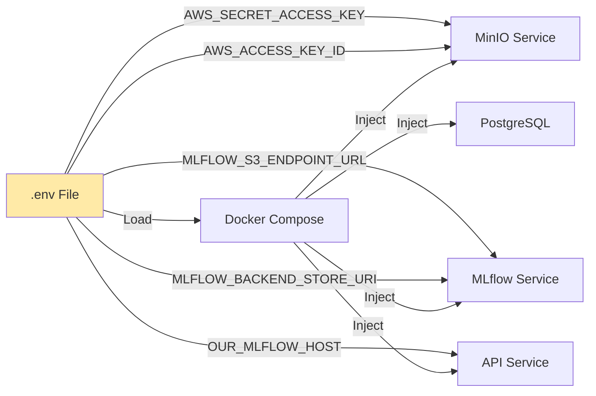

# TNEX Credit Risk ML Pipeline Architecture

## Overall System Architecture

## Detailed Training Pipeline Flow

## Model Serving Architecture

## Docker Network Architecture

## Model Lifecycle Management

## Key Components

### 1. **MLflow Server**
- Tracks experiments, metrics, and parameters
- Manages model registry and versions
- Uses PostgreSQL for metadata
- Uses MinIO for artifact storage

### 2. **MinIO (S3-compatible storage)**
- Stores model artifacts (`.joblib` files)
- Stores plots and reports
- Bucket: `mlflow-artifacts`

### 3. **FastAPI Prediction Service**
- Loads models using MLflow aliases
- Validates input schemas
- Returns risk predictions
- Health checks for dependencies

### 4. **Model Pipeline**
- Preprocessing: Handle missing values, duplicates
- Feature Engineering: Encoding, scaling
- Training: XGBoost/LightGBM with hyperparameter tuning
- Evaluation: AUC, Precision, Recall, F1

### 5. **Docker Network**
- All services on `mlops` network
- Service discovery via container names
- Environment variables for configuration

## Configuration Flow

## Deployment Workflow

1. **Training**: Run pipeline → Log to MLflow → Register model
2. **Validation**: Test model with staging alias
3. **Promotion**: Update alias to `production`
4. **Serving**: API loads model by alias → Serves predictions
5. **Monitoring**: Track metrics, logs, errors
6. **Rollback**: Change alias back if issues detected

---

**Legend:**
- 🔴 Red: MLflow components
- 🔵 Blue: API/Service components
- 🟡 Yellow: Storage components
- 🟢 Green: Data/Pipeline components
